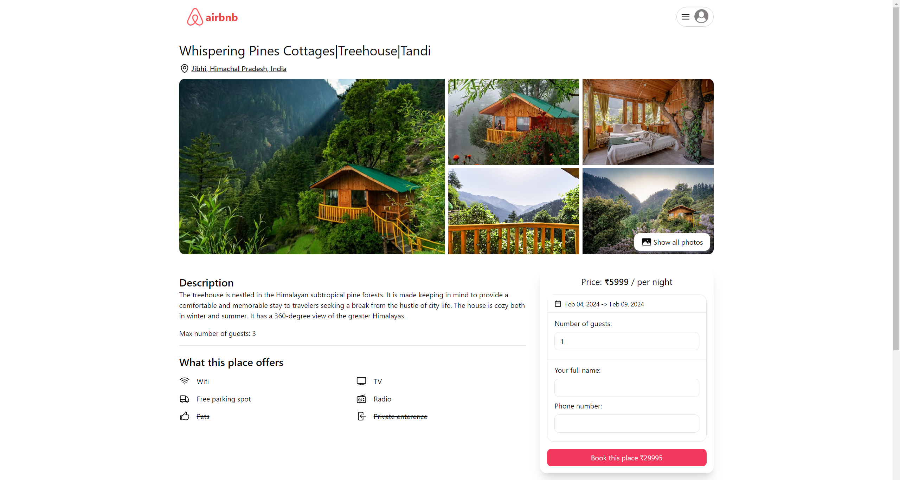

🌐 Airbnb Clone
✨ Overview
A full-stack web application replicating Airbnb's core functionality. Built using the MERN stack to allow users to search for accommodations, view details, make bookings, and manage listings.

🚀 Getting Started
Clone the Repository

bash
Copy
Edit
git clone https://github.com/rahul4019/airbnb-clone.git
Install Dependencies

Navigate to the client folder and install frontend dependencies:
bash
Copy
Edit
yarn install
Navigate to the api folder and install backend dependencies:
bash
Copy
Edit
yarn install
Setup ENV Variables

In the client folder, create a .env file:
bash
Copy
Edit
VITE_BASE_URL=http://localhost:4000  
VITE_GOOGLE_CLIENT_ID=your-google-client-id  
In the api folder, create a .env file:
bash
Copy
Edit
PORT=4000  
DB_URL=your-database-url  
JWT_SECRET=your-secret  
JWT_EXPIRY=20d  
COOKIE_TIME=7  
SESSION_SECRET=your-session-secret  
CLOUDINARY_NAME=your-cloudinary-name  
CLOUDINARY_API_KEY=your-cloudinary-key  
CLOUDINARY_API_SECRET=your-cloudinary-secret  
CLIENT_URL=http://localhost:5173  
Run the Project

Start the frontend:
bash
Copy
Edit
yarn run dev  
Start the backend:
bash
Copy
Edit
yarn start  

  

- **Search Listings:** Users can search for accommodations.

  

- **View Listings:** Users can view detailed information about each accommodation, including photos, descriptions, amenities.

  

- **Make Bookings:** Authenticated users can book accommodations for specific dates.

  

- **Manage Listings:** Hosts can create, edit, and delete their listings.

  

- **Responsive Design:** The application is designed to be responsive and work seamlessly across different devices.

  

## Technologies Used

- **MongoDB:** NoSQL database for storing user data, listings.
- **Express.js:** Web application framework for building the backend server.
- **React.js:** JavaScript library for building the user interface.
- **Node.js:** JavaScript runtime environment for executing server-side code.
- **Tailwind CSS:** A utility-first CSS framework
- **Shadcn:** UI library for styling based on Tailwind CSS
- **JWT:** JSON Web Tokens for secure user authentication.
- **Cloudinary:** Cloud-based image management for storing and serving images.
- **Google Cloud:** For gmail based authentication
